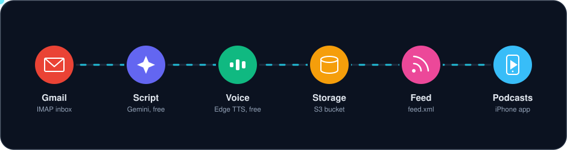
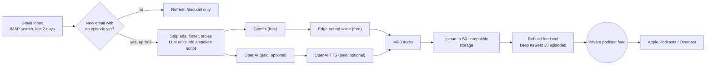

# Newsletter Podcasts (Morning Brew, MarketWatch, WSJ)

[](https://github.com/claudeforruben-cmd/morning-brew-audio/actions/workflows/daily.yml)


On a schedule, this checks Gmail for new newsletter emails, has an LLM edit
each one into a listenable script (ads, footer, tables removed; wording kept),
turns it into an MP3 with a free neural text-to-speech voice, and publishes it
to a **private podcast feed**. All newsletters share one show, and each
episode title starts with its newsletter (e.g. `WSJ · Sep 24: Yields Up, Stocks
Flat`). Subscribe once in Apple Podcasts on your iPhone; each episode shows up
automatically, with lock-screen controls, speed control, and offline download.

<p align="center">
  
</p>

Feed URL: `<PUBLIC_BASE_URL>/<FEED_TOKEN>/feed.xml`

| Newsletter | `--source` | Title prefix |
|---|---|---|
| Morning Brew | `brew` | `Morning Brew · ` |
| MarketWatch Midday Report | `marketwatch` | `MarketWatch · ` |
| WSJ Markets P.M. | `wsj` | `WSJ · ` |

Subscribe the bot's Gmail directly to each newsletter (forwarding from another
inbox adds hours of lag). Welcome and confirmation emails are skipped. To add a
newsletter, add a `Source(...)` in `brew.py` and its name to the workflow's
`source` options.

<details>
<summary><strong>How a run works</strong></summary>



A run with nothing new finishes in seconds and, with the default free
providers (Gemini + Edge TTS), costs $0. See [Schedule](#schedule) for when
each newsletter's window runs.

</details>

## One-time setup

### 1. Gmail access
The job reads mail over IMAP with an app password.

- **Recommended:** create or use a personal Gmail and subscribe it to Morning
  Brew at morningbrew.com. School/work Google accounts (e.g. `@cornell.edu`)
  often disable app passwords, so a dedicated inbox is the reliable route.
- Turn on 2-Step Verification, then create an app password at
  <https://myaccount.google.com/apppasswords>.

### 2. Storage (Supabase, free, no card)
Any S3-compatible bucket works; Supabase's free tier needs no payment method.
1. Sign up at supabase.com and create a project (any name, note the password
   is irrelevant here). The project's short ID is in its URL: `<ref>.supabase.co`.
2. **Storage -> New bucket** named `brew-audio`, and switch on **Public bucket**.
3. **Storage -> S3 Connection**: copy the endpoint URL (`https://<ref>.supabase.co/storage/v1/s3`)
   and the region, then **New access key** and copy the Access Key ID and Secret.
4. Your public base URL is
   `https://<ref>.supabase.co/storage/v1/object/public/brew-audio`.

(Cloudflare R2 or Backblaze B2 also work; only the values below change.)

### 3. Feed token
The feed lives at an unguessable path. Generate it:

```
python3 -c "import secrets; print(secrets.token_urlsafe(24))"
```

### 4. GitHub
Push this folder to a **private** GitHub repo, then add these under
**Settings -> Secrets and variables -> Actions**:

| Secret | Value |
|---|---|
| `GMAIL_ADDRESS` | the Gmail address |
| `GMAIL_APP_PASSWORD` | the app password |
| `GEMINI_API_KEY` | free key from <https://aistudio.google.com/apikey> (no card) |
| `S3_ENDPOINT_URL` | the S3 endpoint from step 2 |
| `S3_ACCESS_KEY_ID`, `S3_SECRET_ACCESS_KEY` | from step 2 |
| `S3_BUCKET` | `brew-audio` |
| `S3_REGION` | the region shown on the S3 Connection page |
| `PUBLIC_BASE_URL` | the public base URL from step 2 |
| `FEED_TOKEN` | from step 3 |

Run **Actions -> Newsletter podcasts -> Run workflow** once to publish the
first episodes. The feed URL is at the top (GitHub masks the secret parts in
logs).

### 5. iPhone
In Apple Podcasts: **Search** tab, paste the feed URL into the search box, and
tap the result, then **Follow**. (On a Mac: *File -> Follow a Show by URL...*;
it syncs to your iPhone.) In the show's settings, turn on **Download Episodes:
Latest** so it is ready offline before you leave. Overcast and Pocket Casts
also accept feed URLs.

## Schedule
The workflow runs every 30 minutes from 09:17 to 14:47 UTC (Morning Brew),
16:17 to 17:47 UTC (MarketWatch Midday Report, sent around noon ET) and 20:17
to 23:47 UTC (WSJ Markets P.M., sent after the close). Each run publishes any
email from the last 2 days that has no episode yet, so a late or forwarded
email is caught by the next run, and a run with nothing new finishes in seconds. It logs the newest email it saw for each
source. A source that errors turns the run red without blocking the others.
Edit the `cron` lines in `.github/workflows/daily.yml` to change the windows.
GitHub pauses scheduled workflows after 60 days without repository activity;
if episodes stop, re-enable the workflow under the Actions tab.

## Local use
```
python3 -m venv .venv && .venv/bin/pip install -r requirements.txt
.venv/bin/python -m unittest discover -s tests

# Preview the spoken script for any text file (needs GEMINI_API_KEY)
.venv/bin/python brew.py --source wsj --from-file email.txt --script-only

# Full run into ./public instead of cloud storage
FEED_TOKEN=test PUBLIC_BASE_URL=http://localhost:8000 .venv/bin/python brew.py --from-file email.txt
```

Optional env vars: `EDGE_VOICE` (default `en-US-AndrewMultilingualNeural`; try
`en-US-AvaMultilingualNeural`), `EDGE_RATE` (default `+5%`), `SCRIPT_MODEL`,
`BREW_TZ` (default `America/New_York`).

Paid, higher-quality option: set `SCRIPT_PROVIDER=openai` and/or
`TTS_PROVIDER=openai` (plus `OPENAI_API_KEY`), roughly $0.15-0.25/day.

## Notes
- The feed is marked `itunes:block`, so it is kept out of public podcast
  directories. Keep the URL to yourself: it is a personal-use narration of a
  copyrighted newsletter and shouldn't be shared.
- The script step edits rather than summarizes, and a guard logs a warning if
  the script contains a number that isn't in the email. LLMs can still slip, so
  treat this as a listening convenience, not a source of record.
- The free voice uses Microsoft Edge's online text-to-speech through the
  unofficial `edge-tts` library. It costs nothing but is not an official API and
  could break; if it does, switch `TTS_PROVIDER` to `openai`.
- The last 30 episodes across all newsletters are kept; older files are deleted
  from the bucket.
